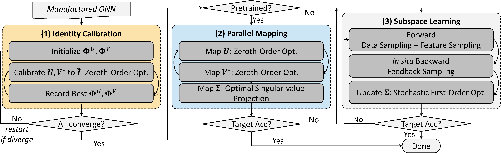
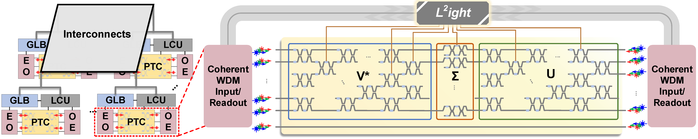

# L2ight

By [Jiaqi Gu](https://github.com/JeremieMelo), [Hanqing Zhu](https://github.com/zhuhanqing), [Chenghao Feng](https://github.com/Fengchenghao1996), [Zixuan Jiang](https://github.com/zixuanjiang), Ray T. Chen and David Z. Pan.

This repo is the official implementation of "L2ight: Enabling On-Chip Learning for Optical Neural Networks via Efficient in-situ Subspace Optimization".

# Introduction
**L2ight** is a closed-loop ONN on-chip learning framework to enable scalable ONN mapping and efficient *in-situ* learning.
**L2ight** adopts a three-stage learning flow that first calibrates the complicated photonic circuit states under challenging physical constraints, then performs photonic core mapping via combined analytical solving and zeroth-order optimization.
A subspace learning procedure with multi-level sparsity is integrated into **L2ight** to enable *in-situ* gradient evaluation and fast adaptation, unleashing the power of optics for real on-chip intelligence.
**L2ight** outperforms prior ONN training protocols with **3-order-of-magnitude** higher scalability and over **30X** better efficiency, when benchmarked on various models and learning tasks.
This synergistic framework is the *first* scalable on-chip learning solution that pushes this emerging field from *intractable* to *scalable* and further to *efficient* for next-generation self-learnable photonic neural chips.



# Dependencies
* Python >= 3.6
* pyutils >= 0.0.1. See [pyutils](https://github.com/JeremieMelo/pyutility) for installation.
* pytorch-onn >= 0.0.1. See [pytorch-onn](https://github.com/JeremieMelo/pytorch-onn) for installation.
* Python libraries listed in `requirements.txt`
* NVIDIA GPUs and CUDA >= 10.2

# Structures
* core/
    * models/
        * layers/
            * custom_conv2d and custom_linear layers
            * utils.py: sampler and profiler
        * sparse_bp_\*.py: model definition
        * sparse_bp_base.py: base model definition; identity calibration and mapping codes.
    * optimizer/: mixedtrain and flops optimizers
    * builder.py: build training utilities
* script/: contains experiment scripts
* train_pretrain.py, train_map.py, train_learn.py, train_zo_learn.py: training logic
* compare_gradient.py: compare approximated gradients with true gradients for ablation

# Usage
* Pretrain model.\
`> python3 train_pretrain.py config/cifar10/vgg8/pretrain.yml`

* Identity calibration and parallel mapping. Please set your hyperparameters in CONFIG=`config/cifar10/vgg8/pm/pm.yml` and run\
`> python3 train_map.py CONFIG --checkpoint.restore_checkpoint=path/to/your/pretrained/checkpoint`

* Subspace learning with multi-level sampling. Please set your hyperparameters in CONFIG=`config/cifar10/vgg8/ds/learn.yml` and run\
`> python3 train_learn.py CONFIG --checkpoint.restore_chekcpoint=path/to/your/mapped/checkpoint --checkpoint.resume=1`

* All scripts for experiments are in `./script`. For example, to run subspace learning with feedback sampling, column sampling, and data sampling, you can write proper task setting in SCRIPT=`script/vgg8/train_ds_script.py` and run\
`> python3 SCRIPT`

* Comparison experiments with RAD [ICLR 2021] and SWAT-U [NeurIPS 2020]. Run with the SCRIPT=`script/vgg8/train_rad_script.py` and `script/vgg8/train_swat_script.py`,\
`> python3 SCRIPT`

* Comparison with FLOPS [DAC 2020] and MixedTrn [AAAI 2021]. Run with the METHOD=`mixedtrain` or `flops`,\
`> python3 train_zo_learn.py config/mnist/cnn3/METHOD/learn.yml`

# Citing L2ight
```
@inproceedings{gu2021L2ight,
  title={L2ight: Enabling On-Chip Learning for Optical Neural Networks via Efficient in-situ Subspace Optimization},
  author={Jiaqi Gu and Hanqing Zhu and Chenghao Feng and Zixuan Jiang and Ray T. Chen and David Z. Pan},
  journal={Conference on Neural Information Processing Systems (NeurIPS)},
  year={2021}
}
```
